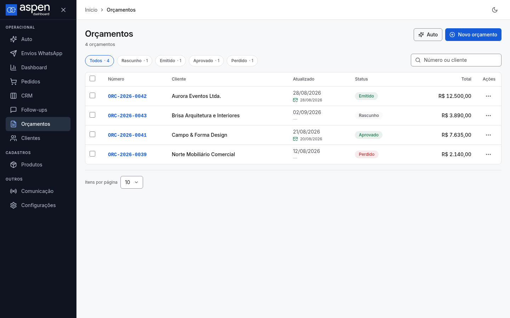
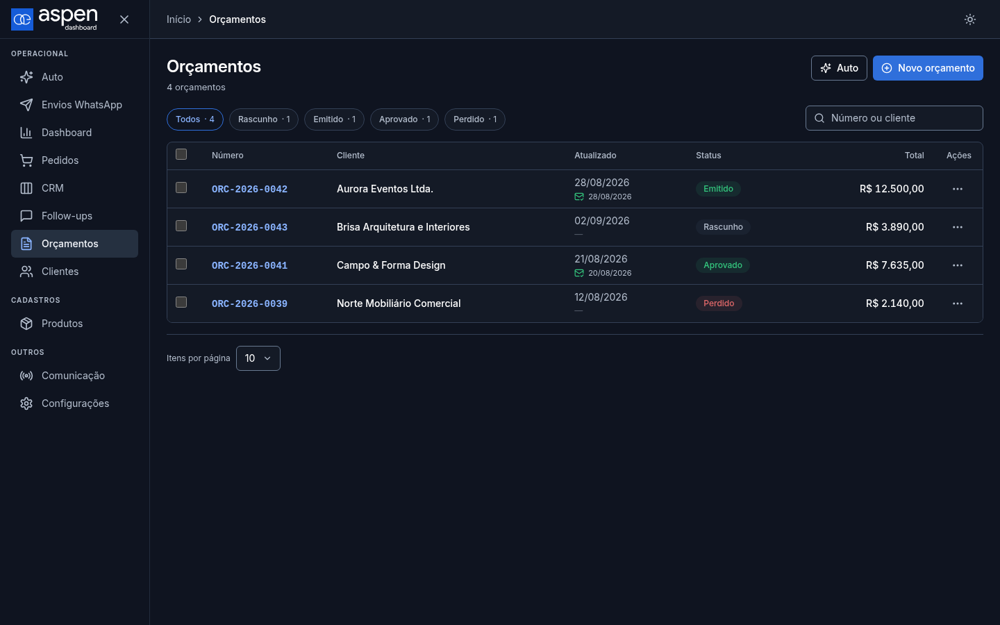
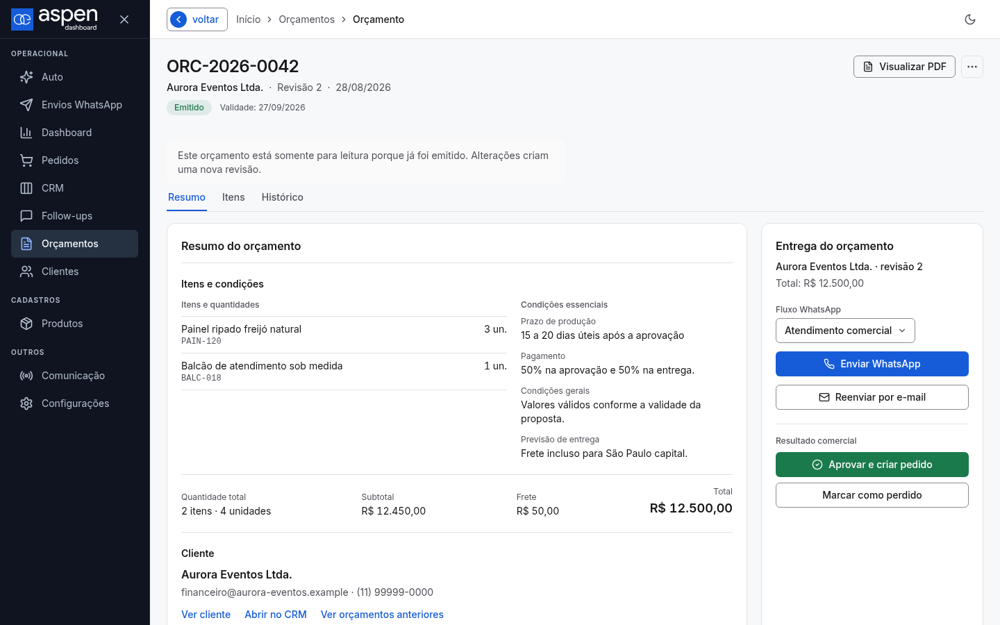
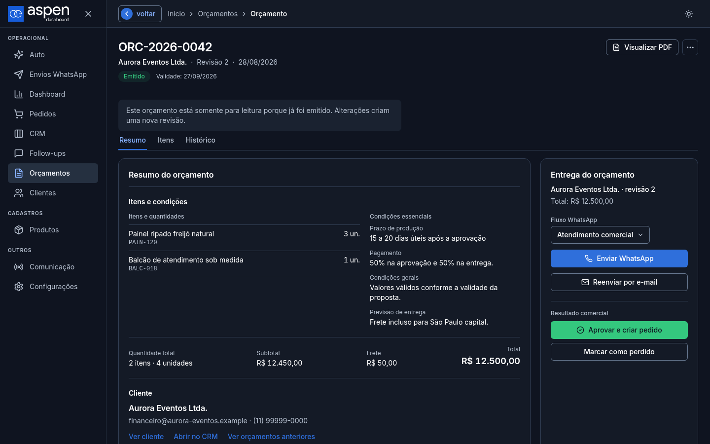
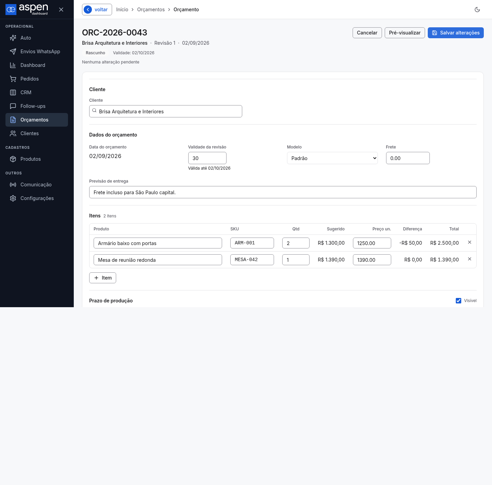
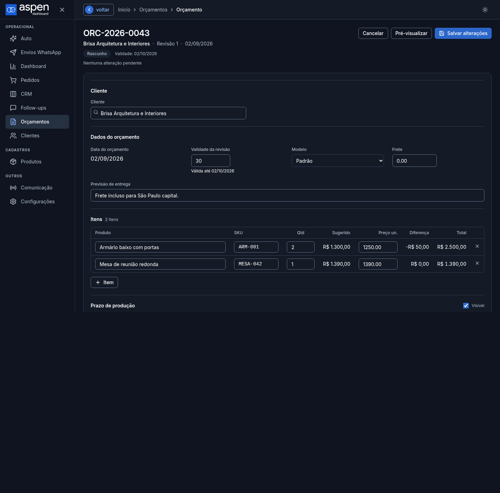
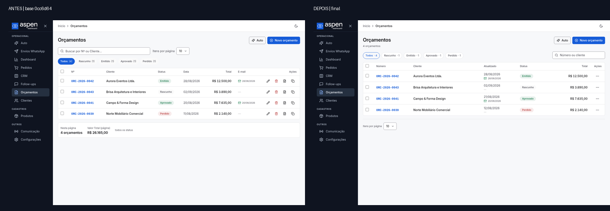
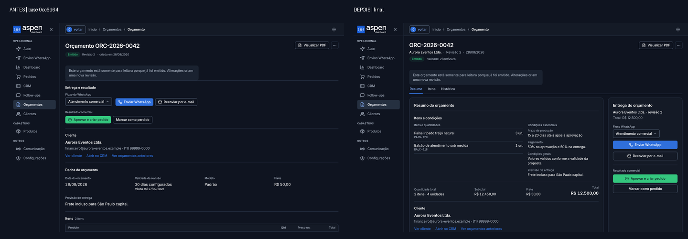

# Evidência visual: consulta de Orçamentos

Registro histórico de validação da entrega inicial, não um contrato visual.
As capturas do detalhe emitido antecedem o redesenho posterior. A composição
atual está em [DESIGN-aspen.md](../../DESIGN-aspen.md#approved-orçamentos-consultation-slice).

## Recorte e isolamento

- Base controlada: `0cc6d6453d44ad7430b66f2d665af25989e19090` (`origin/master`).
- Figma consultado: arquivo `N8BOVUvLkQImveVtThA5CV`, nós `8:2` (lista),
  `79:186` (revisão), `81:265` (rascunho) e `81:599` (emitido/preparar envio).
  Os nós relacionados `86:38` e `89:51` foram usados como confirmação, sem
  acrescentar conteúdo ao produto.
- Captura com `DOTENV_CONFIG_PATH=/dev/null`, fixtures locais, APIs
  interceptadas, mutações bloqueadas e rede externa bloqueada. Nenhuma emissão,
  mensagem, migration ou exportação real foi executada.

## Capturas finais

As imagens abaixo são um conjunto enxuto da matriz final em `1440 × 900`.

| Vista           | Claro                                                | Escuro                                               |
| --------------- | ---------------------------------------------------- | ---------------------------------------------------- |
| Lista           |              |              |
| Detalhe emitido |  |  |
| Rascunho/edição |        |        |

A matriz completa gerada fora do repositório contém 16 capturas, incluindo
`1280 × 800`, `1440 × 900`, `1024 × 800` e `390 × 844`, lista, emitido e
rascunho nos dois temas quando aplicável. Os estilos computados, auditorias e logs estão em
`/opt/data/aspen-quotations-goal/final-worker`.

### Antes e depois

O “antes” foi recapturado do archive verificado de `0cc6d64` com as mesmas
fixtures, viewports, fontes e política de rede do “depois”. Os 759 blobs
rastreados do archive coincidiram com o Git, sem divergências.

## Verificações finais

- `npm run verify:fast`: passou.
- `DOTENV_CONFIG_PATH=/dev/null npm run test:unit:focused -- tests/unit/quotation-ui-v2.test.ts`: 3/3 passaram.
- `DOTENV_CONFIG_PATH=/dev/null PLAYWRIGHT_BROWSERS_PATH=/opt/data/.playwright npx playwright test tests/quotations-core.spec.js`: 10/10 passaram.
- `DOTENV_CONFIG_PATH=/dev/null node /opt/data/aspen-quotations-goal/final-capture.mjs`: 16 capturas, 78 eventos de API, zero mutações e zero bloqueios de rede não permitidos; auditoria registrou menu em top layer sem recorte, reserva da bulk bar, overflow horizontal de página ausente e contraste ativo acima de 4,5:1.
- Imagens do app foram aguardadas e validadas antes de cada captura; o logo
  carregou com dimensão natural `300 × 77` tanto no baseline quanto no final.
- `git diff --check`: passou.
- Inspeção visual final: hierarquia, filtros, síntese do Resumo, tabela completa
  na aba Itens, editor sem coluna lateral fixa, ações secundárias, painel
  lateral de 320 px no emitido, abas, quebra de conteúdo, foco e overflow foram
  conferidos em claro/escuro.

`verify:full`, PostgreSQL real e E2E completo foram omitidos conforme a lane
FAST e o escopo visual. Os avisos de KV/template durante o servidor local não
alteraram os testes, que interceptam essas respostas.

## Diferenças intencionais

- O vocabulário exibido usa `Emitido`, preservando o valor cru `enviado` nos
  filtros e contratos existentes.
- O e-mail continua disponível como contexto de atualização e nas ações do
  detalhe, sem uma coluna primária própria.
- Duplicar e excluir foram movidos para o menu secundário nativo por linha;
  seleção em lote e barra de ações permanecem disponíveis.
- O total de rascunho fica no resumo lateral para evitar duplicação visual entre
  conferência e resumo, mantendo o valor calculado existente.

Este registro não representa aprovação do usuário, merge ou deploy.
