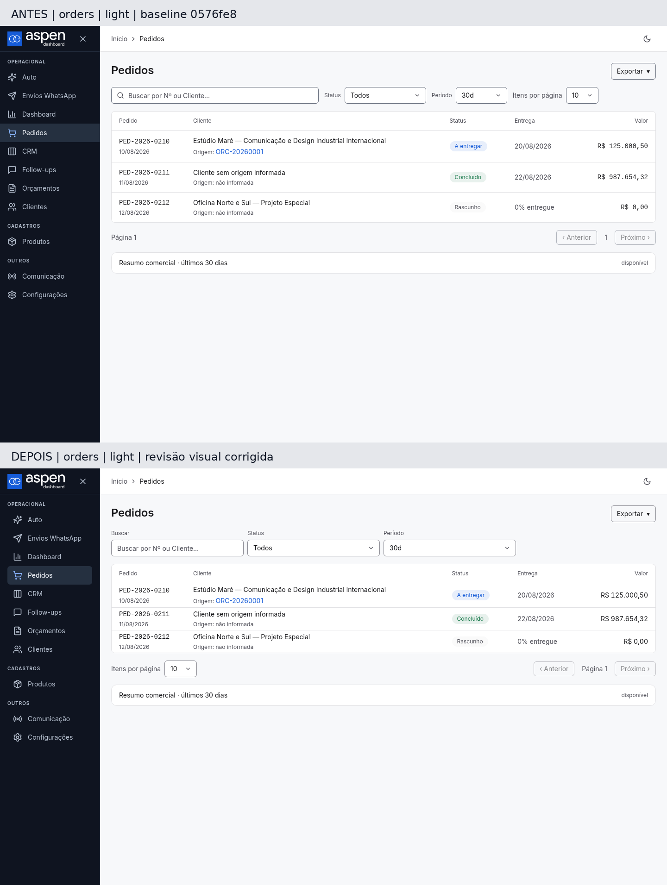
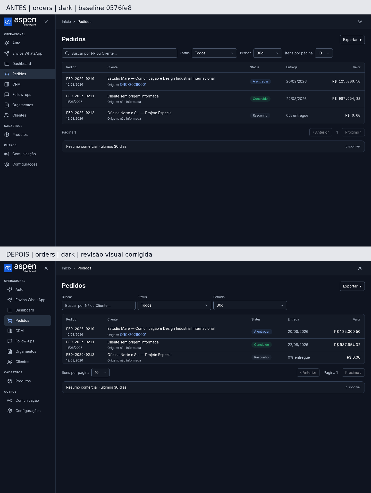
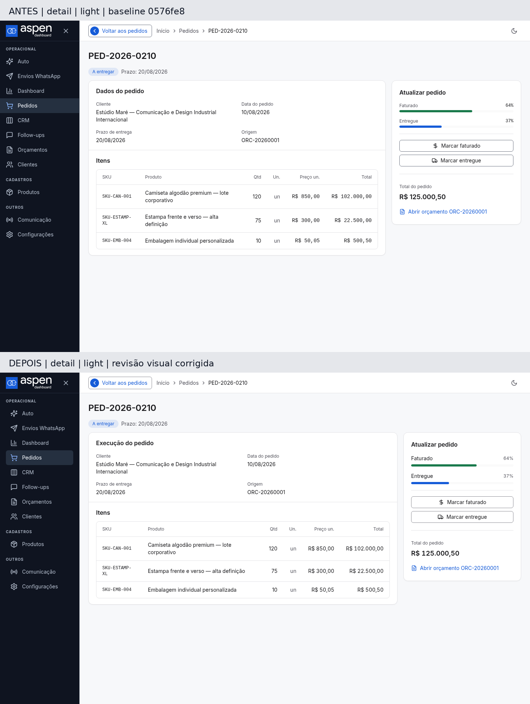
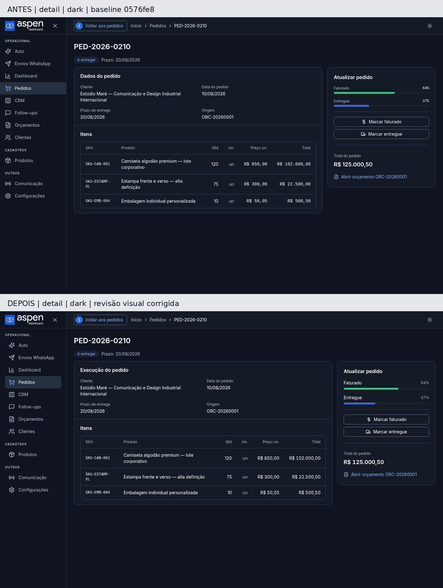

# Evidência visual: fundação e Pedidos após #211

Registro de validação desta entrega, não um contrato visual. A referência normativa continua sendo [DESIGN-aspen.md](../../DESIGN-aspen.md).

## Origem e isolamento

- Base do antes: `0576fe8`, extraída por `git archive`. Os 754 arquivos rastreados foram comparados por hash Git com a base, sem divergências.
- Depois: branch `fix/pedidos-fidelidade-figma`.
- Relatório do usuário: `aspen-revisao-design.md`, revisão de 07/09/2026.
- Figma atual consultado via MCP com `get_design_context`, `get_variable_defs` e screenshots: fundações, componentes, Pedidos claro/escuro e detalhe.
- Referências: [componentes](https://www.figma.com/design/N8BOVUvLkQImveVtThA5CV?node-id=6-2), [Pedidos](https://www.figma.com/design/N8BOVUvLkQImveVtThA5CV?node-id=12-2), [detalhe](https://www.figma.com/design/N8BOVUvLkQImveVtThA5CV?node-id=12-131), [escuro](https://www.figma.com/design/N8BOVUvLkQImveVtThA5CV?node-id=65-21).
- Navegador Chromium local, ambiente limpo com `DOTENV_CONFIG_PATH=/dev/null`, APIs interceptadas e dados exclusivamente fictícios. Fontes Inter e logotipos reais do checkout carregados antes das capturas. O mesmo conjunto de dados foi aplicado ao antes e depois.
- Nenhuma operação de produção, emissão, mensagem, migration ou exportação real.

## Antes e depois, 1440 × 900

Cada imagem mostra a base em cima e a entrega embaixo. Abra o arquivo original para conferir em resolução completa.

### Lista clara

### Lista escura

### Detalhe claro

### Detalhe escuro

A matriz completa foi entregue também em ZIP: 1280×800, 1440×900, 1024×800 e 390×844, lista/detalhe, claro/escuro, com capturas adicionais abaixo da dobra. O pacote contém medições computadas, scripts de auditoria e logs reais da validação final. Capturas exploratórias de rodadas anteriores não integram o pacote final.

## Verificações finais executadas

- `npm run verify:fast`: passou.
- `npm run test:unit:focused -- tests/unit/sales-order-view-model.test.ts tests/unit/ui-contract.test.ts`: 13/13 passaram. Somente expectativas antigas de tokens no teste existente foram atualizadas; não foram criados testes de classes CSS.
- `npx playwright test tests/issue-210.spec.js tests/task-8-fix-r1.spec.js --grep='lista|detalhe|pedido|pedidos|paginação|retorno|exportação|métricas' --workers=2`: 16/16 passaram.
- Smoke de 15 rotas em ambos os temas: 30 combinações passaram, sem erros de navegador, overflow horizontal de documento ou requisições inesperadas no auditor.
- Matriz visual: 16 combinações de página/tema/viewport passaram na auditoria final. Capturas verificadas também visualmente.
- Estilos computados: sidebar 216 px, cabeçalho 56 px, margens de conteúdo 24 px em desktop, controles 36 px, valores Inter 14/20 com `tabular-nums` e alinhamento à direita. Em 1440 px, lista com 1176 px úteis e sem `max-width` externo. Painel do detalhe com 320 px em desktop.
- Conferidos: bordas dos controles, contraste da seleção da sidebar e links visíveis, tabela e seu contêiner real, posição e unicidade da paginação, assets carregados e ausência de overflow. Em 390 px, filtros de largura inteira e cartões existentes preservados.
- `git diff --check`: passou.
- Uma revisão Codex independente da implementação, seguida de correções pelo worker e revalidação pelo orquestrador. Não houve uma segunda revisão independente alegada como aprovação.

Os E2E registram avisos de depreciação do Node e uma leitura local indisponível de template; os 16 testes passaram. O smoke isolado de navegador não registrou erros. `verify:full`, PostgreSQL real, build RELEASE e E2E completo foram omitidos intencionalmente conforme a lane FAST.

## Diferenças intencionais preservadas

- Navegação e nomes atuais continuam os da aplicação, conforme #210. Não foi implantado o redesenho global de outros módulos.
- Períodos, status suportados, exportações, resumo comercial recolhido e paginação baseada em `has_more` foram preservados. Não foi inventado total de registros ou de páginas.
- Identificadores reais mantêm a apresentação técnica existente; valores monetários usam a família Inter. A coluna de origem e os dados adicionais existentes permanecem.
- Progresso de faturamento e entrega permanece independente, junto das ações existentes no painel lateral. Não foram introduzidas etapas, cálculos ou regras novas.
- Cores ajustadas por contraste já aprovadas na #210 foram mantidas. Em particular, ação primária escura, destrutivo, foco e chrome da sidebar não foram substituídos cegamente por cores ilustrativas dos sketches.
- Formulários e painéis com restrição interna continuam intencionais: manual/configurações, conversa/revisão e painel operacional não impõem limite às listas.

Pedidos está preparado para aprovação visual do usuário. Este registro não representa aprovação do usuário, merge ou deploy manual.
